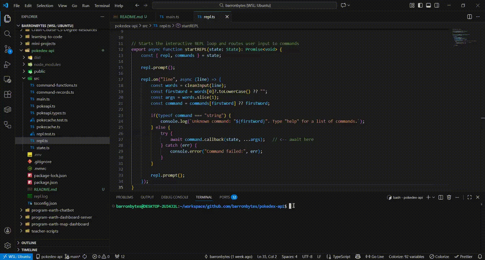

# Pokédex API

This project uses a CLI frontend with a REPL loop to fetch data from the PokéAPI. TypeScript structures maintain session state and cache API responses.

**Project Demo:**



## Tech Stack

- **Frontend:** TypeScript (CLI / REPL-based)
- **Backend:** n/a (consumes the public PokéAPI)
- **Runtime:** Node.js v22.15.0+
- **Tooling:** npm, TypeScript, Vitest

## Project Structure

``` bash
pokedex-cli/
├── public/                     # Media assets
├── src/
│   ├── main.ts                 # Application entry point
│   ├── state.ts                # Centralized session state shared across commands
│   ├── repl.ts                 # REPL loop handling user input and output
│   ├── command-records.ts      # CLI command definitions and command registry
│   ├── command-functions.ts    # Business logic executed by CLI commands
│   ├── pokeapi.ts              # HTTP client for interacting with the PokéAPI
│   ├── pokeapi.types.ts        # TypeScript types and schemas for PokéAPI responses
│   └── cache.ts                # In-memory cache to prevent redundant API calls
├── .gitignore                  # Git ignore rules
├── .env                        # Environment variable configuration
├── .nvmrc                      # Node.js version specification
├── package.json                # Project metadata and dependencies
├── package-lock.json           # Dependency lockfile
├── tsconfig.json               # TypeScript compiler configuration
├── repl.log                    # Logged REPL session output
└── README.md                   # Project documentation

# Before running this project locally, ensure you have the following installed:
- IDE (VS Code, PyCharm, etc.)
- Install Python 3.10+ version: visit python.org/downloads/
- Node.js v22.15.0 or higher (version specified in .nvmrc)

# Dev Dependencies
- TypeScript: static typing and compilation
- @types/node: Node.js type definitions for TypeScript
- Vitest: unit testing framework

# Dependencies
- dotenv: loads environment variables from a .env file
- zod: runtime schema validation and type-safe data parsing
```

## Quick Start

This repo will later be, if not already, saved as a subfolder. Be sure to only clone relevant files. Then, do the following:

### Project and Dependencies Setup

1. Clone repository
2. Install [NVM](https://github.com/nvm-sh/nvm)
3. Activate v22.15.0 from `.nvmrc` file >> `nvm use`
4. Initialize Node.js project >> `npm init -y`
5. Install dev dependencies >> `npm install -D @types/node typescript vitest`
6. Install dependencies >> `npm install dotenv zod`
7. Configure `tsconfig.json` >> provided comments in file for guidance
8. Configure `package.json` >> `"type"` property arleady set and included four `"scripts": {}`

Step #3 creates the `package.json` file. Steps #5-6 add `node_modules/` and `package-lock.json`, and update `package.json` with the installed dependencies.

### Environmental Variables Setup

The app uses environmental variables. `APP_PROMPT` sets the REPL prompt; `CACHE_INTERVAL_MS` controls how frequently data is cached; and `BASE_LOCATION_URL` and `BASE_POKEMON_URL` define the PokéAPI endpoints for fetching locations and Pokémon data. These are publicly visible. Hiding them in the `.gitignore` file is unnecessary since no API keys are used in this project.

### .gitignore File Setup

You can configure this file as follows:

```bash
node_modules/
dist/
repl.log
```

## Usage

### Run the Program

Start the program:

> `npm run dev`

### Program Commands

- `help` >> Displays a help message
- `map` >> Displays the next 20 location area names
- `mapb` >> Displays the previous 20 location area names
- `explore LOCATION-AREA-NAME` >> List Pokémon names found within a location area
- `catch POKEMON-NAME` >> Attempt to catch a Pokémon and add it to your Pokédex
- `inspect POKEMON-NAME` >> Display individual Pokémon information from Pokédex
- `pokedex` >> Display all caught Pokémon as part of Pokédex
- `exit` >> Exits the Pokedex

## System Design

### 1. Requirements

**Functional Requirements:**

- CLI frontend accepts user commands
- Commands fetch data from PokéAPI endpoints
- Command actions include: listing location areas, viewing Pokémon by area, catching Pokémon, inspecting caught Pokémon, and showing caught Pokémon in the Pokédex
- Stronger Pokémon should be more difficult to catch

**Optional Requirements:**

- Verbose mode: include additional metadata in command output
- Low latency: aim for response times under ~200ms
- Scalability: support up to ~1M daily active users (DAU)
- CAP consideration: prioritize consistency (accurate state and cache) over availability in failure scenarios
- Cache management: save new API responses, purge stale data based on cache interval

### 2. Core Entities

**Environment Settings:**

- APP_PROMPT (string) — CLI prompt displayed to the user
- CACHE_INTERVAL_MS (number) — duration (ms) for caching API responses
- BASE_LOCATION_URL (string) — PokéAPI endpoint for location areas
- BASE_POKEMON_URL (string) — PokéAPI endpoint for individual Pokémon

**CLI Commands (CLICommand):**

> export type CLICommand = {<br>
>  name: string;<br>
>  description: string;<br>
>  callback: (state: State, ...args: string[]) => Promise<void>;<br>
> };

Available Commands:
- help — displays help message
- map/mapb — lists next/previous location areas
- explore — lists Pokémon in a location area
- catch — attempts to catch a Pokémon and add to Pokédex
- inspect — displays details of a caught Pokémon
- pokedex — lists all caught Pokémon
- exit — closes the CLI

**PokéAPI Data Types:**

- Locations — paginated list of location areas
- LocationArea — individual location area with Pokémon encounters
- Pokemon — individual Pokémon with stats, types, and base attributes

**Cache State:**

> export type CacheEntry<T> = {
>  cachedAt: number;  // timestamp when this API response was cached
>  response: T;       // the actual PokeAPI response
> };

**CLI State:**

- repl (Interface) — Node readline interface for user interaction
- commands (Record<string, **CLICommand**>) — all available CLI commands and their callbacks
- nextLocationsURL / prevLocationsURL (string | null) — pagination state for location areas
- pokedex (Record<string, **Pokemon**>) — caught Pokémon, keyed by name
- pokeApiCache (PokeApiCache) — in-memory cache for API responses

### 3. API (or Interface)

**Command-Line Interface (CLI):**

> npm run start
> Pokedex > <user_command> [optional arguments]

**Command Calls:**

> command.callback(state: State, ...args: string[])
>
> helperFunction(pageURL: string | null) -> Promise<ApiCallResult<T>>

- Program state includes a **repl** interface and **commands** instance:
- The REPL contains logic to decide what function to call:
  - Parses user input into tokens with `cleanInput(input: string)`
  - Assigns first token to `key` and remaining tokens to `args`
  - Searches for `key` in state: `commands: Record<string, CLICommand>`
  - Matches will invoke callback functions asynchronously: `command.callback(state, ...args)`
  - Callback functions will use `args` to construct endpoint URL

- Helper functions use **Zod library** to validate raw JSON responses against typed schemas
- Helper functions standardize output and error handling with **result type pattern**: `({ success: true; data } | { success: false; error })`

**Cache Management:**

> `state.pokeApiCache.getResponse(url) -> CacheEntry | undefined`  
> `state.pokeApiCache.addResponse(url, apiResponse)`  

- Program state includes a **pokeApiCache** instance:
  - Command and helper functions consume cache data transparently
  - The program state saves cache data as a map: `Map<string, CacheEntry<any>>()`
- Each cached entry is a `CacheEntry<T>` containing:
  - `cachedAt` — timestamp (ms) when the API response was stored  
  - `response` — the actual API response data (`T`)  
- `getResponse(url)`: program checks cache prior to making new API calls
- `addResponse(url)`: program updates cache on each new API call
- Stale entries are automatically purged in the background by the private `#reap()` method, using `CACHE_INTERVAL_MS`  

**State Management:**

## Credits and Contributing

[Boot.dev](https://www.boot.dev) provided the project requirements and guidance to complete this project. Contributions are welcome! Feel free to report any problems.